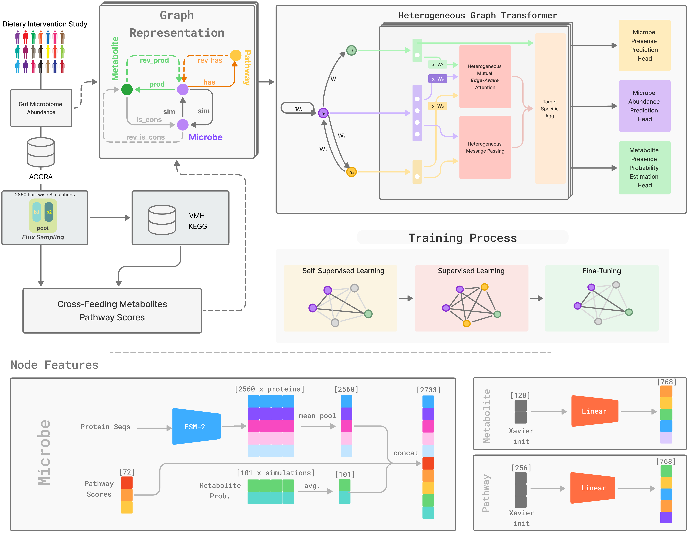

# Microbial Cross-Feeding Simulation Pipeline for SIMBA-GNN


This repository contains code and data for simulating pairwise microbial interactions in the human gut microbiome. 
The paper is available at: 

The code and details for SIMBA's GNN architecture are available at: [https://github.com/msparsa/simba/]

## Overview

- **Input**: Microbial abundance data from a high-fiber diet study ([Diener et al., 2020](https://doi.org/10.1093/bioinformatics/btaa234))  
- **Models**: GEMs from AGORA v1.03 ([Heinken et al., 2020](https://doi.org/10.1038/s41597-020-0433-6))  
- **Simulations**: 2,850 pairwise co-cultures simulated using COBRApy under anaerobic, high-fiber diet  
- **Flux Sampling**: `optGpSampler`  
- **Pathway Analysis**: Functional fingerprints derived from KEGG and VMH annotations

## Features

- Multi-compartment models with a shared lumen for metabolite exchange  
- Diet-constrained flux simulations reflecting gut conditions  
- Quantification of cross-fed metabolites  
- Functional analysis of microbe-microbe interactions
- Pathway activity scoring based on KEGG and VMH annotations

### SIMBA pipeline


## Requirements

- Python 3.8+  
- [COBRApy](https://github.com/opencobra/cobrapy)  
- 'optGpSampler'
- numpy, pandas, scipy, matplotlib, seaborn

## Usage

Run the simulation pipeline:

```bash
cd sampling
python main_sampling.py
```

Ensure all required model files and input data (e.g., GEMs, diet constraints) are placed in the correct subdirectories.

## Related Work

This pipeline complements the SIMBA framework, which models microbial community behavior using graph neural networks and metabolic modeling.

## Citation

If you use this repository, please cite the associated publication:

> [Insert citation or preprint link here]

## License

This project is licensed under the Creative Commons Attribution 4.0 International License.
